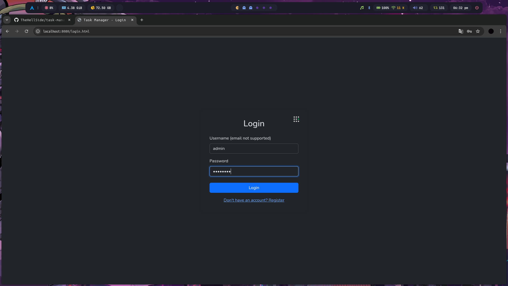
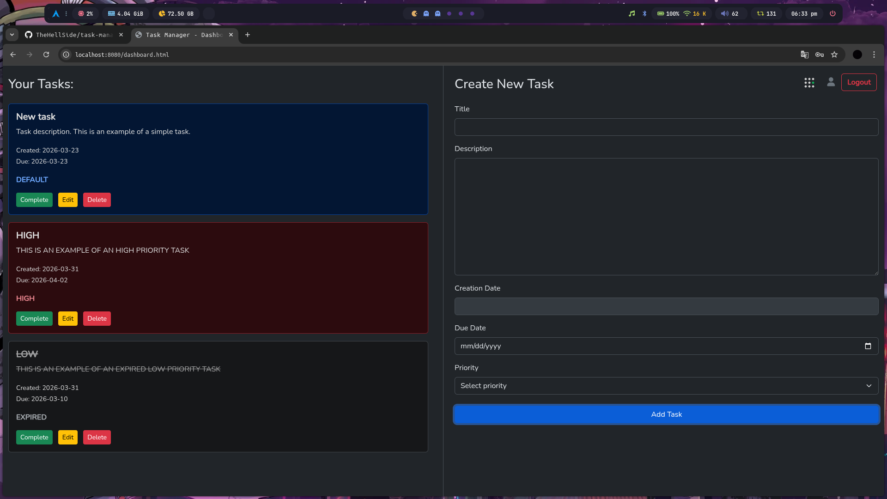
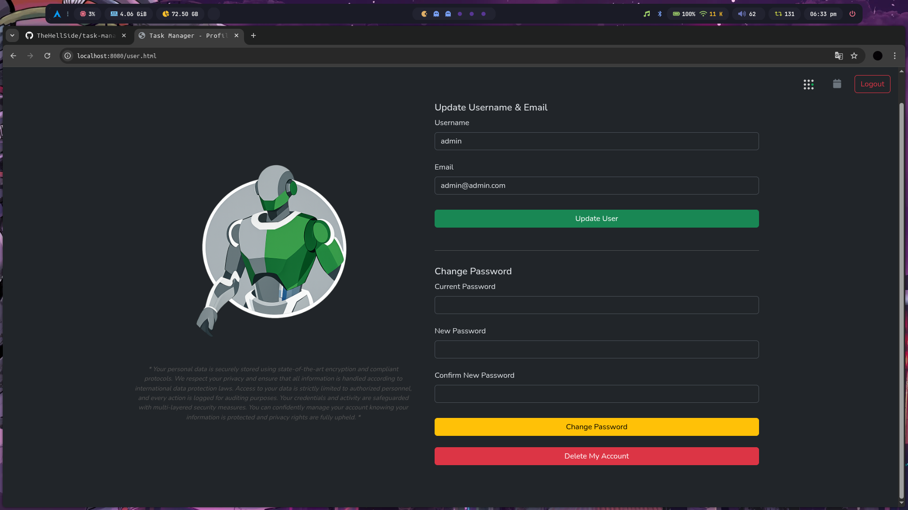

<div align="center">


# Task Manager WebApp

**A full-stack task management application built with Java & Spring Boot.**  
Organize your work, track priorities, and manage your account — all in one clean, responsive interface.

[](https://openjdk.org/)
[](https://spring.io/projects/spring-boot)
[](https://mariadb.org/)
[](https://maven.apache.org/)
[](LICENSE)
[](https://getbootstrap.com/)

[Features](#-features) · [Screenshots](#-screenshots) · [Tech Stack](#-tech-stack) · [Quick Start](#-quick-start) · [API Reference](#-api-reference) · [Configuration](#-configuration) · [Security](#-security)

</div>

---

## 📋 Overview

**Task Manager WebApp** is a production-ready, full-stack web application that gives users a central hub for creating, prioritizing, and tracking tasks. Built on **Spring Boot 3.5.4** and backed by **MariaDB**, it follows a clean MVC architecture with a RESTful API backend and a vanilla HTML/CSS/JavaScript frontend. No JavaScript frameworks — just clean, fast, dependency-light code.

Key highlights:
- 🔐 **Secure by design** — BCrypt hashing, HttpOnly cookies, input sanitization, SameSite CSRF protection
- 🎨 **Dark / Light theme** — persisted per-browser in `localStorage`
- 📱 **Fully responsive** — Bootstrap 5 grid adapts from mobile to desktop
- ⚡ **Fast setup** — one SQL import and one Maven command to get running

---

## ✨ Features

### Task Management

| Feature | Description |
|---|---|
| ✅ Create tasks | Add tasks with title, description, due date, and priority |
| 📝 Edit tasks | Inline update of any task field |
| 🗑️ Delete tasks | Permanently remove tasks with one click |
| ☑️ Complete tasks | Toggle completion status on any task |
| 🏷️ Priority levels | **HIGH** (red), **MEDIUM** (yellow), **LOW** (green), **EXPIRED** (auto, gray) |
| ⏰ Auto-expiration | Tasks past their due date are automatically flagged as `EXPIRED` |
| 🔍 Filter by priority | Filter the task list by any priority level |

### User Management

| Feature | Description |
|---|---|
| 📝 Registration | Create an account with email and username |
| 🔑 Login / Logout | Secure session-based authentication |
| 👤 Profile update | Change username or email address |
| 🔒 Password change | Requires current password verification before updating |
| 💀 Account deletion | Permanently delete account and all associated data |

### UI / UX

| Feature | Description |
|---|---|
| 🌗 Theme toggle | Switch between dark and light mode, persisted in localStorage |
| 📱 Responsive design | Bootstrap 5.3 grid — works on any screen size |
| 🎨 Clean interface | Minimal, distraction-free layout using Google Fonts (Nunito) |
| 🚨 Input validation | Client-side and server-side validation with user-friendly error messages |

---

## 📸 Screenshots

### 🔐 Login Page

<div align="center">
  
  <p><em>Clean authentication interface with light/dark theme support</em></p>
</div>

### 📊 Task Dashboard

<div align="center">
  
  <p><em>Main dashboard — task list on the left, task editor on the right</em></p>
</div>

### 👤 User Profile

<div align="center">
  
  <p><em>Profile management — update info, change password, or delete account</em></p>
</div>

---

## 🛠 Tech Stack

### Backend

| Technology | Version | Purpose |
|---|---|---|
| Java | 24 | Core language |
| Spring Boot | 3.5.4 | Application framework |
| Spring Data JPA | 3.5.4 | ORM / database access layer |
| Hibernate | (via JPA) | SQL dialect and DDL management |
| MariaDB JDBC Driver | Latest | Database driver |
| Spring Security Crypto | Latest | BCrypt password hashing |
| Apache Commons Text | 1.10.0 | HTML escaping / sanitization |
| OWASP Java HTML Sanitizer | 20211018.1 | XSS protection |
| Maven | 3.6+ | Build and dependency management |

### Frontend

| Technology | Version | Purpose |
|---|---|---|
| HTML5 | — | Semantic page structure |
| CSS3 | — | Custom styling |
| JavaScript (ES6+) | — | Client-side interactivity (no frameworks) |
| Bootstrap | 5.3.3 | Responsive layout and components |
| Google Fonts (Nunito) | — | Typography |

### Architecture

```
Client (Browser)
      │
      │  HTTP/HTTPS
      ▼
┌─────────────────────────────────────────┐
│         Spring Boot Application         │
│                                         │
│  ┌─────────┐  ┌────────────────────┐   │
│  │ Static  │  │   REST Controllers │   │
│  │ Assets  │  │  /api/v1/user      │   │
│  │ HTML /  │  │  /api/v1/task      │   │
│  │ CSS/JS  │  │  /api/v1/token     │   │
│  └─────────┘  └────────┬───────────┘   │
│                         │               │
│               ┌─────────▼──────────┐   │
│               │   Service Layer    │   │
│               │  Business Logic /  │   │
│               │  Auth Validation   │   │
│               └─────────┬──────────┘   │
│                         │               │
│               ┌─────────▼──────────┐   │
│               │  Repository Layer  │   │
│               │  Spring Data JPA   │   │
│               └─────────┬──────────┘   │
└─────────────────────────┼─────────────┘
                          │
                ┌─────────▼──────────┐
                │      MariaDB       │
                │  task_manager_     │
                │     webapp         │
                └────────────────────┘
```

---

## 🚀 Quick Start

### Prerequisites

- **Java 24** (as required by `pom.xml`; earlier versions are not supported)
- **Maven 3.6+** (or use the included `mvnw` wrapper)
- **MariaDB 10.5+** running locally

### 1. Clone the Repository

```bash
git clone https://github.com/TheHellSide/task-manager-webapp.git
cd task-manager-webapp
```

### 2. Set Up the Database

Import the provided SQL dump to create the schema:

```bash
mysql -u root -p < src/main/resources/dump.sql
```

> The dump creates the `task_manager_webapp` database and all required tables automatically.

### 3. Configure the Application

Open `src/main/resources/application.properties` and update the database credentials:

```properties
spring.datasource.url=jdbc:mariadb://localhost:3306/task_manager_webapp
spring.datasource.username=YOUR_DB_USERNAME
spring.datasource.password=YOUR_DB_PASSWORD
```

> ⚠️ **Security Notice:** The committed `application.properties` contains default credentials (`root` / `admin123`). You **must** replace these with your own values before running the application — even locally on a shared machine. Never deploy with the default credentials.

### 4. Build and Run

```bash
# Using Maven wrapper (recommended)
./mvnw spring-boot:run

# Or on Windows
mvnw.cmd spring-boot:run

# Or build a JAR first
./mvnw clean package
java -jar target/task-manager-webapp-*.jar
```

### 5. Open in Browser

```
http://localhost:8080
```

You will land on the homepage. Click **Register** to create your first account, then log in and start managing tasks!

---

## 🗂 Project Structure

```
task-manager-webapp/
│
├── assets/                                   # README screenshots
│   ├── dashboard.png
│   ├── login.png
│   └── user-profile.png
│
├── src/
│   ├── main/
│   │   ├── java/com/example/task_manager_webapp/
│   │   │   │
│   │   │   ├── TaskManagerApplication.java   # Spring Boot entry point
│   │   │   │
│   │   │   ├── security/
│   │   │   │   ├── Security.java             # Input sanitization utilities
│   │   │   │   └── tokens/
│   │   │   │       ├── Token.java            # Token JPA entity
│   │   │   │       ├── TokenController.java  # Token REST endpoints
│   │   │   │       ├── TokenRepository.java  # Token data access
│   │   │   │       └── TokenService.java     # Token business logic
│   │   │   │
│   │   │   ├── tasks/
│   │   │   │   ├── Task.java                 # Task JPA entity
│   │   │   │   ├── TaskPriority.java         # Enum: LOW | MEDIUM | HIGH | EXPIRED | DEFAULT
│   │   │   │   ├── TaskConfiguration.java    # Task bean configuration
│   │   │   │   ├── TaskController.java       # Task REST endpoints
│   │   │   │   ├── TaskRepository.java       # Task data access
│   │   │   │   ├── TaskService.java          # Task business logic
│   │   │   │   └── dto/
│   │   │   │       └── TaskRequestDTO.java   # Task request payload
│   │   │   │
│   │   │   └── users/
│   │   │       ├── User.java                 # User JPA entity
│   │   │       ├── UserConfiguration.java    # User bean configuration
│   │   │       ├── UserController.java       # User REST endpoints
│   │   │       ├── UserRepository.java       # User data access
│   │   │       ├── UserService.java          # User business logic
│   │   │       ├── dto/
│   │   │       │   ├── PasswordRequest.java
│   │   │       │   ├── login/
│   │   │       │   │   ├── LoginRequest.java
│   │   │       │   │   └── LoginResponse.java
│   │   │       │   └── register/
│   │   │       │       └── RegistrationRequest.java
│   │   │       └── mapper/
│   │   │           └── UserMapper.java       # User ↔ DTO mapping
│   │   │
│   │   └── resources/
│   │       ├── application.properties        # App configuration
│   │       ├── dump.sql                      # Database schema + seed
│   │       └── static/                       # Served as-is by Spring Boot
│   │           ├── index.html                # Landing / homepage
│   │           ├── login.html                # Login page
│   │           ├── register.html             # Registration page
│   │           ├── dashboard.html            # Task management dashboard
│   │           ├── user.html                 # User profile page
│   │           ├── css/
│   │           │   ├── index-style.css
│   │           │   ├── authentication-style.css
│   │           │   ├── dashboard-style.css
│   │           │   └── user-style.css
│   │           ├── js/
│   │           │   ├── dashboard-script.js
│   │           │   ├── login-script.js
│   │           │   ├── register-script.js
│   │           │   ├── user-script.js
│   │           │   └── global/
│   │           │       ├── theme-toggle.js
│   │           │       ├── logout.js
│   │           │       ├── input-sanitizer.js
│   │           │       └── invalid-char-alert.js
│   │           └── images/
│   │               ├── logo_light.svg        # Logo — light theme variant
│   │               ├── logo_dark.svg         # Logo — dark theme variant
│   │               └── profile/
│   │                   └── robot.png         # Default user avatar
│   │
│   └── test/
│       └── java/com/example/task_manager_webapp/
│           └── TaskManagerApplicationTests.java
│
├── pom.xml                                   # Maven build descriptor
├── mvnw / mvnw.cmd                           # Maven wrapper scripts
└── LICENSE
```

---

## 📡 API Reference

All endpoints are prefixed with `/api/v1`. Authentication is carried in an HttpOnly cookie named `authentication-token`, set automatically on login.

### 👤 User Endpoints — `/api/v1/user`

| Method | Path | Auth Required | Description |
|---|---|---|---|
| `POST` | `/api/v1/user` | ❌ | Register a new user |
| `POST` | `/api/v1/user/in` | ❌ | Log in and receive a session cookie |
| `POST` | `/api/v1/user/out` | ✅ | Log out and invalidate the session cookie |
| `PUT` | `/api/v1/user/me` | ✅ | Update username and/or email |
| `DELETE` | `/api/v1/user/me` | ✅ | Delete account and all associated tasks |
| `POST` | `/api/v1/user/me/verify-password` | ✅ | Verify current password before changing it |
| `PUT` | `/api/v1/user/me/password` | ✅ | Update the account password |
| `POST` | `/api/v1/user/me/extend-session` | ✅ | Extend the current session by 30 days |

#### Register — `POST /api/v1/user`

**Request body:**
```json
{
  "username": "johndoe",
  "email": "john@example.com",
  "password": "securePassword123"
}
```

| Status | Body |
|---|---|
| `201 Created` | `"User successfully registered."` |
| `400 Bad Request` | `"User already exists."` |

#### Login — `POST /api/v1/user/in`

**Request body:**
```json
{
  "username": "johndoe",
  "password": "securePassword123"
}
```

| Status | Body |
|---|---|
| `200 OK` | User object; sets `authentication-token` HttpOnly cookie (30-day expiry) |
| `401 Unauthorized` | `"Invalid username or password"` |

#### Update User — `PUT /api/v1/user/me`

**Query parameters:** `?username=newName&email=new@email.com` (both optional)

| Status | Body |
|---|---|
| `200 OK` | `"User information successfully updated."` |
| `404 Not Found` | `"User not found."` |

#### Verify Password — `POST /api/v1/user/me/verify-password`

**Request body:**
```json
{
  "password": "currentPassword"
}
```

| Status | Body |
|---|---|
| `200 OK` | `"Password verified."` |
| `401 Unauthorized` | `"Incorrect password."` |

#### Change Password — `PUT /api/v1/user/me/password`

**Request body:**
```json
{
  "password": "currentPassword",
  "replacementPassword": "newSecurePassword"
}
```

| Status | Body |
|---|---|
| `200 OK` | `"Password successfully updated."` |
| `404 Not Found` | `"User not found."` |

---

### 📋 Task Endpoints — `/api/v1/task`

All task endpoints require the `authentication-token` cookie.

| Method | Path | Description |
|---|---|---|
| `GET` | `/api/v1/task` | Get all tasks for the authenticated user |
| `POST` | `/api/v1/task` | Create a new task |
| `GET` | `/api/v1/task/{taskId}` | Get a specific task by ID |
| `PUT` | `/api/v1/task/{taskId}` | Update a task |
| `PUT` | `/api/v1/task/{taskId}/check` | Toggle task completion status |
| `DELETE` | `/api/v1/task/{taskId}` | Delete a task |

#### Task Object

```json
{
  "id": 1,
  "title": "Finish project report",
  "description": "Write up the Q3 summary",
  "createdAt": "2025-01-15",
  "dueDate": "2025-01-31",
  "priority": "HIGH",
  "completed": false
}
```

#### Priority Values

| Value | Indicator | Meaning |
|---|---|---|
| `HIGH` | 🔴 Red | Urgent task |
| `MEDIUM` | 🟡 Yellow | Standard priority |
| `LOW` | 🟢 Green | Low urgency |
| `EXPIRED` | ⚫ Gray | Past due date — auto-assigned by the server |
| `DEFAULT` | — | Example / placeholder task |

#### Create Task — `POST /api/v1/task`

**Request body:**
```json
{
  "title": "Finish project report",
  "description": "Write up the Q3 summary",
  "dueDate": "2025-01-31",
  "priority": "HIGH"
}
```

| Status | Body |
|---|---|
| `201 Created` | `"Task successfully added."` |
| `400 Bad Request` | `"User not found or error while saving task."` |

#### Update Task — `PUT /api/v1/task/{taskId}`

**Request body:** Same schema as Create Task.

| Status | Body |
|---|---|
| `200 OK` | `"Task information successfully updated."` |
| `404 Not Found` | `"Task not found."` |

#### Toggle Completion — `PUT /api/v1/task/{taskId}/check`

| Status | Body |
|---|---|
| `200 OK` | `"Task marked as completed."` or `"Task marked as not completed."` |
| `404 Not Found` | `"Failed to update task status. Task may not exist."` |

#### Delete Task — `DELETE /api/v1/task/{taskId}`

| Status | Body |
|---|---|
| `200 OK` | `"Task successfully deleted."` |
| `404 Not Found` | `"Task not found."` |

---

## ⚙️ Configuration

All application settings live in `src/main/resources/application.properties`.

```properties
# Application name
spring.application.name=task-manager-webapp

# ── Database ─────────────────────────────────────────────────────────────────
spring.datasource.url=jdbc:mariadb://localhost:3306/task_manager_webapp
spring.datasource.username=root
spring.datasource.password=admin123          # ⚠️ Change this!
spring.datasource.driver-class-name=org.mariadb.jdbc.Driver

# ── JPA / Hibernate ──────────────────────────────────────────────────────────
spring.jpa.hibernate.ddl-auto=update        # auto-updates schema on startup
spring.jpa.show-sql=true                    # logs all SQL queries
spring.jpa.properties.hibernate.dialect=org.hibernate.dialect.MariaDBDialect

# ── Logging ───────────────────────────────────────────────────────────────────
logging.level.org.springframework=DEBUG
logging.level.com.example=DEBUG
```

### Recommended Changes for Production

| Setting | Recommended Value |
|---|---|
| `spring.datasource.username` | A dedicated, non-root DB user |
| `spring.datasource.password` | A strong, randomly-generated password |
| `spring.jpa.hibernate.ddl-auto` | `validate` or `none` |
| `spring.jpa.show-sql` | `false` |
| `logging.level.org.springframework` | `WARN` or `ERROR` |
| `logging.level.com.example` | `INFO` |

---

## 🔒 Security

The application implements multiple layers of defense:

### Authentication & Sessions

- **Token-based authentication** — A unique session token is generated on login and stored server-side in the database.
- **HttpOnly cookies** — The `authentication-token` cookie is inaccessible to JavaScript, preventing XSS-based token theft.
- **SameSite=Lax cookies** — Protects against cross-site request forgery (CSRF).
- **30-day session expiry** — Tokens automatically expire after 30 days.

### Password Security

- **BCrypt hashing** — All passwords are hashed with BCrypt via Spring Security Crypto before storage. Plain-text passwords are never persisted.
- **Password verification** — Changing a password requires providing the current password first.

### Input Security

- **Server-side sanitization** — All user-supplied text is passed through Apache Commons Text HTML escaping before being returned to clients.
- **OWASP HTML Sanitizer** — Provides an additional layer of XSS prevention on the server.
- **Client-side sanitization** — `input-sanitizer.js` strips dangerous characters before submission; `invalid-char-alert.js` provides immediate user feedback.
- **Parameterized queries** — Spring Data JPA uses parameterized SQL throughout, preventing SQL injection.

---

## 🤝 Contributing

Contributions, issues, and feature requests are welcome!

1. **Fork** the repository
2. **Create** a feature branch: `git checkout -b feature/my-new-feature`
3. **Commit** your changes: `git commit -m 'Add some feature'`
4. **Push** to the branch: `git push origin feature/my-new-feature`
5. **Open a Pull Request** against `main`

Please keep PRs focused on a single feature or bug fix and include a clear description of what changed and why.

---

## 📄 License

This project is licensed under the [MIT License](LICENSE) — feel free to use, fork, and adapt it.

---

## 👤 Author

<div align="center">

Made with ❤️ by **TheHellSide**

[](https://github.com/TheHellSide)

If you find this project useful, please consider leaving a ⭐ — it means a lot!

</div>
